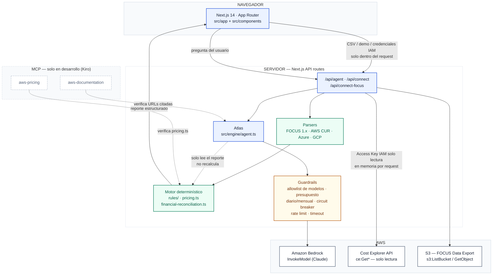
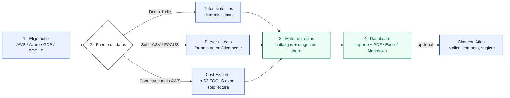
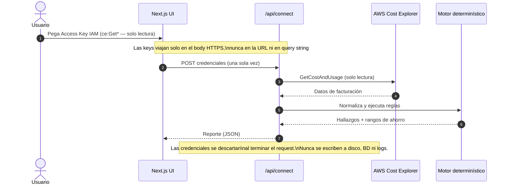
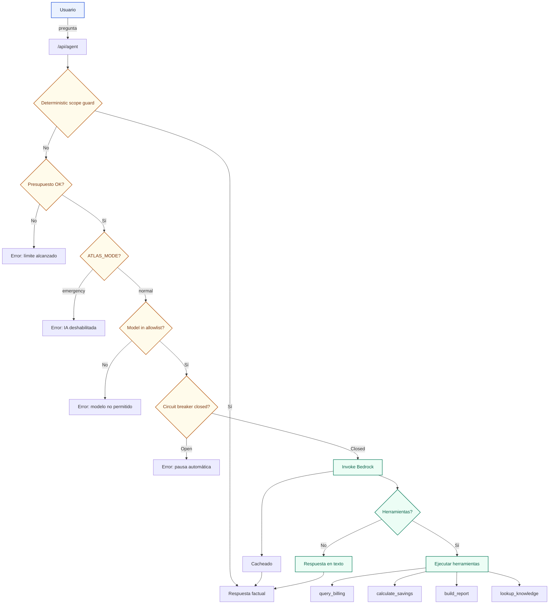

# Diseño de Sistema — FinOps Agent (Nimbus Explorer)

**Versión:** 1.0  
**Estado:** Entregado  
**Fecha:** 2026-07-21  

---

## 1. Visión General de Arquitectura



### 1.1 Principios de Diseño

| Principio | Descripción |
|-----------|-------------|
| **Una única fuente de verdad financiera** | El motor determinístico calcula todas las cifras; Atlas solo explica |
| **Separación estricta** | Motor de reglas, Agentes IA, UI y API son módulos independientes |
| **Seguridad por defecto** | Credenciales nunca se persisten, siempre en memoria por request |
| **Determinismo verificable** | Mismas entradas → mismas salidas, siempre |
| **Observabilidad** | Presupuestos diarios/mensuales, rate limits, circuit breaker |

### 1.2 Estructura de Directorios

```
src/
├── app/                      # Next.js App Router
│   ├── api/
│   │   ├── agent/           # Chat con Atlas (Bedrock)
│   │   ├── analyze/         # Análisis de CSV
│   │   ├── connect/         # Conexión AWS Cost Explorer
│   │   ├── connect-focus/   # Conexión AWS S3 FOCUS Data Export
│   │   ├── demo-csv/        # Generación de datos demo
│   │   └── exports/         # Exportación de reportes
│   ├── layout.tsx           # Layout raíz con Providers (Locale + Theme)
│   ├── globals.css          # Tailwind + tokens de tema
│   └── page.tsx             # Página principal (Flow UI)
├── components/              # React Components
│   ├── agent-chat.tsx       # UI del agente conversacional
│   ├── aws-connect-section.tsx
│   ├── focus-s3-connect-section.tsx
│   ├── upload-section.tsx
│   ├── report-dashboard.tsx
│   ├── finding-card.tsx
│   ├── report-charts.tsx
│   ├── icons.tsx
│   ├── theme/
│   └── i18n/
├── engine/                  # Motor de reglas determinístico
│   ├── agent.ts             # Atlas (agente IA sobre Bedrock)
│   ├── analysis-store.ts    # Almacenamiento temporal de análisis
│   ├── atlas-controls.ts    # Guardrails y límites de Atlas
│   ├── aws-connector.ts     # Conector Cost Explorer
│   ├── focus-s3-connector.ts # Conector S3
│   ├── csv-parser.ts        # Parser base
│   ├── demo-data.ts         # Generación de datos demo
│   ├── financial-reconciliation.ts
│   ├── parsers/             # Parsers por formato
│   │   ├── focus-parser.ts
│   │   ├── aws-parser.ts
│   │   ├── azure-parser.ts
│   │   ├── gcp-parser.ts
│   │   └── index.ts
│   ├── pricing.ts           # Tabla de precios de referencia
│   ├── rules/               # Reglas de detección de desperdicio
│   │   ├── ai-spend.ts
│   │   ├── idle-resources.ts
│   │   ├── oversized-instances.ts
│   │   ├── storage-waste.ts
│   │   └── index.ts
│   ├── scenarios.ts         # Cálculo de escenarios
│   ├── tools/               # Herramientas del agente
│   │   ├── build-report.ts
│   │   ├── calculate-savings.ts
│   │   ├── generate-remediation.ts
│   │   ├── query-billing.ts
│   │   └── index.ts
│   ├── trends.ts            # Análisis de tendencias
│   ├── types.ts             # Tipos core
│   └── validation/          # Validación de archivos
├── theme/                   # Tema claro/oscuro
│   ├── theme-constants.ts
│   ├── theme-provider.tsx
│   └── theme-toggle.tsx
└── i18n/                    # Internacionalización ES/EN
    ├── config.ts
    ├── dictionaries/
    │   ├── es.ts
    │   └── en.ts
    ├── glossary.ts
    ├── labels.ts
    ├── locale-provider.tsx
    ├── locale-toggle.tsx
    ├── translate.ts
    └── document-locale.ts
```

---

## 2. Componentes Principales

### 2.1 UI Principal (`page.tsx`)

**Responsabilidad:** Orquestar el flujo completo del usuario

**Estados:**
- `choose-cloud`: Selección de proveedor (AWS / Azure / GCP / FOCUS)
- `data-source`: Selección de fuente (demo / CSV / live connect)
- `analyzing`: Procesamiento de datos
- `dashboard`: Visualización de resultados

**Flujo de datos:**
1. Usuario elige proveedor → UI actualiza `provider`
2. Usuario selecciona fuente → UI invoca API correspondiente
3. Datos recibidos → UI registra análisis en `analysis-store`
4. Reporte calculado → UI muestra dashboard

### 2.2 Agent Chat (`agent-chat.tsx`)

**Responsabilidad:** Interfaz conversacional con Atlas

**Características:**
- Mensajes de usuario/agent con markdown inline
- Badge de herramientas llamadas
- Indicador de modo (determinístico vs LLM)
- Sugerencias de preguntas iniciales
- Scroll automático a nuevo contenido

**Interacción con Atlas:**
```typescript
interface AgentMessage {
  role: "user" | "assistant";
  content: string;
  toolCalls?: { tool: string }[];
  atlasMode?: "deterministic" | "llm";
  cached?: boolean;
  totalTokens?: number;
}
```

### 2.3 Report Dashboard (`report-dashboard.tsx`)

**Responsabilidad:** Visualización de hallazgos y métricas

**Pestañas:**
- `overview`: Métricas clave (gasto bruto, ahorro potencial, % de ahorro)
- `findings`: Lista de hallazgos con tarjetas expandibles
- `scenarios`: Simulador de ahorros
- `markdown`: Reporte completo en Markdown

**Componentes clave:**
- Tarjeta de resumen con métricas
- Gráficos de barras por categoría y servicio
- Tarjetas de hallazgos expandibles
- Tabla de tendencias

### 2.4 Upload Section (`upload-section.tsx`)

**Responsabilidad:** Carga de archivos CSV

**Características:**
- Drag & drop
- Validación de formato (CSV/Excel)
- Despliegue de error de mismatch de proveedor
- Botón de descarga de muestra por lane
- Confirmación de seguridad (privacidad, verificabilidad, auditabilidad)

### 2.5 AWS Connect Section (`aws-connect-section.tsx`)

**Responsabilidad:** Conexión live a AWS Cost Explorer

**Campos:**
- Access Key ID (required)
- Secret Access Key (required)
- Session Token (optional)
- Region (dropdown)
- Period (7/14/30/60/90 días)

**Botones:**
- Validar credenciales
- Analizar (con fecha de inicio/end calculadas)

### 2.6 Focus S3 Connect Section (`focus-s3-connect-section.tsx`)

**Responsabilidad:** Conexión live a FOCUS Data Export en S3

**Campos:**
- Bucket (required)
- Prefix (optional)
- Access Key ID (required)
- Secret Access Key (required)
- Session Token (optional)
- Region (dropdown, bucket's region)

**Validación:**
- `s3:ListBucket` sobre bucket/prefix
- Lectura de archivo más reciente `.csv.gz`

---

## 3. Flujo de Datos

### 3.1 Flujo de Uso del Usuario



### 3.2 Flujo de Conexión AWS (Modelo de Seguridad)



### 3.3 Flujo de Atlas (Agente IA)



---

## 4. Motor de Reglas

### 4.1 Reglas Regitradas (`allRules`)

```typescript
// src/engine/rules/index.ts
export const allRules: Rule[] = [
  // idle-resources.ts
  idleEC2Rule,
  idleElasticIPRule,
  idleSnapshotRule,
  idleLoadBalancerRule,
  // oversized-instances.ts
  oversizedEC2Rule,
  // storage-waste.ts
  s3UnusedBucketsRule,
  s3OldVersionsRule,
  ebsUnattachedVolumesRule,
  ebsSnapshotsRule,
  missingCommitmentsRule,
  legacyGenerationRule,
  // ai-spend.ts
  aiVisibilityRule,
  aiGpuInstancesRule,
  aiBedrockOnDemandRule,
  aiSageMakerEndpointsRule,
  ai AttributionRule,
];
```

### 4.2 Estructura de Regla

```typescript
interface Rule {
  id: string;                    // ID único (ej: "IDLE-EC2-001")
  title: LocalizedMessage;       // Título localizable
  description: LocalizedMessage; // Descripción técnica
  category: CostCategory;        // Categoría de desperdicio
  minDistinctDays: number;       // Umbral mínimo de datos
  evaluate(records): Finding[];  // Evaluación sobre registros
}
```

### 4.3 Hallazgo (`Finding`)

```typescript
interface Finding {
  id: string;
  title: string;
  description: string;
  service: string;
  category: CostCategory;
  savingsRange: { conservative: number; moderate: number; optimistic: number };
  estimatedMonthlySavingsUSD: number;
  priorityScore: number;
  effort: EffortLevel;
  risk: RiskLevel;
  confidence: ConfidenceLevel;
  calculationBreakdown: string;
  remediation: {
    investigation: string[];  // Comandos de solo lectura
    application: string[];    // Comandos de aplicación
  };
  assumptions: FindingAssumption[];
  ruleId?: string;
}
```

---

## 5. Seguridad

### 5.1 Credenciales del Usuario

**Política:**
- Credenciales IAM del usuario solo en memoria durante cada request
- **Nunca** se escriben a disco, base de datos ni logs
- **Nunca** se envían a terceros (solo a AWS APIs)
- Limpiadas inmediatamente después de usar

**Implementación:**
```typescript
// src/app/api/connect/route.ts
const credentials: AWSCredentials = {
  accessKeyId,           // Leído del body
  secretAccessKey,       // Leído del body
  sessionToken,          // Leído del body (opcional)
  region,
};

// Usado solo en este request, nunca persistido
await fetchCostData({ credentials, startDate, endDate });
```

### 5.2 Credenciales de Bedrock

**Política:**
- Leídas solo de variables de entorno del servidor
- **Nunca** aceptadas desde navegador
- Validación de allowlist de modelos
- Encriptación en reposo (según plataforma de despliegue)

**Implementación:**
```typescript
// src/app/api/agent/route.ts
function getBedrockConfig(): AgentConfig | null {
  const accessKeyId = process.env.BEDROCK_ACCESS_KEY_ID;
  const secretAccessKey = process.env.BEDROCK_SECRET_ACCESS_KEY;
  // ... lectura de env vars
}
```

### 5.3 Sanitización de Datos

**Política:**
- Todos los strings del archivo del usuario deben ser sanitizados
- Eliminar caracteres de control
- Limitar longitud máxima (300 caracteres)
- Nunca splicear en prose libre (solo en JSON con envelope explícito)

**Implementación:**
```typescript
// src/engine/agent.ts
const MAX_UNTRUSTED_FIELD_LENGTH = 300;

function sanitizeUntrustedText(raw: string): string {
  const stripped = stripControlChars(raw);
  return stripped.length > MAX_UNTRUSTED_FIELD_LENGTH
    ? `${stripped.slice(0, MAX_UNTRUSTED_FIELD_LENGTH)}…`
    : stripped;
}
```

### 5.4 Guardrails de Atlas

**Variables de entorno:**
```typescript
ATLAS_MODE=normal                           // normal | emergency
ATLAS_ALLOWED_MODEL_IDS=...                 // allowlist separado por comas
ATLAS_MAX_INPUT_CHARACTERS=12000            // Rechaza prompts excesivos
ATLAS_MAX_BILLING_ROWS=50000                // Máximo de filas por sesión
ATLAS_MAX_OUTPUT_TOKENS=800                 // Tope de salida por llamada
ATLAS_MAX_MESSAGES_PER_AUDIT=20             // Tope por sesión de auditoría
ATLAS_MAX_TOOL_CALLS=2                      // Tope de herramientas por respuesta
ATLAS_MAX_HISTORY_MESSAGES=8                // Historial textual conservado
ATLAS_REQUEST_TIMEOUT_MS=30000              // Timeout por llamada a Bedrock
ATLAS_MAX_CONCURRENT_REQUESTS=4             // Concurrencia global
ATLAS_IP_WINDOW_MS=3600000                  // Ventana del rate limit por IP
ATLAS_MAX_MESSAGES_PER_IP=30                // Solicitudes por IP/ventana
ATLAS_DAILY_TOKEN_BUDGET=500000             // Hard stop diario de tokens
ATLAS_DAILY_COST_BUDGET_USD=10              // Hard stop diario de costo
ATLAS_MONTHLY_COST_BUDGET_USD=100           // Hard stop mensual
ATLAS_CIRCUIT_BREAKER_FAILURES=3            // Fallos consecutivos antes de pausar
ATLAS_CIRCUIT_BREAKER_OPEN_MS=60000         // Duración de la pausa
```

---

## 6. Internacionalización

### 6.1 Estructura

```
src/i18n/
├── config.ts                // Locale es|en, DEFAULT_LOCALE, LOCALE_STORAGE_KEY
├── dictionaries/
│   ├── es.ts                // Fuente de verdad
│   └── en.ts                // Traducción
├── glossary.ts              // Términos protegidos (no se traducen)
├── labels.ts                // Etiquetas de effort/risk/confidence
├── locale-provider.tsx      // Hook useLocale/useT
├── locale-toggle.tsx        // Toggle UI
├── translate.ts             // translate, interpolate, formatPlural
└── document-locale.ts       // Lang attribute
```

### 6.2 Términos Protegidos

**Categorías:**
- Metodología (FinOps, FOCUS, Well-Architected, Savings Plans, etc.)
- Columnas FOCUS (BilledCost, EffectiveCost, ServiceCategory, etc.)
- Comandos cloud (AWS CLI, Azure CLI, GCP CLI)
- Servicios cloud (EC2, S3, EBS, Lambda, Bedrock, SageMaker, etc.)

**Implementación:**
```typescript
// src/i18n/glossary.ts
export const protectedTerms = {
  methodology: ["FinOps", "FOCUS", "Well-Architected", "Savings Plans", "Reservations", "CUDs"],
  columns: ["BilledCost", "EffectiveCost", "ServiceCategory", "CommitmentDiscountId"],
  commands: ["aws", "az", "gcloud"],
  services: ["EC2", "S3", "EBS", "Lambda", "Bedrock", "SageMaker", "RDS"],
};
```

---

## 7. Tema

### 7.1 Tokens de CSS Custom Properties

```css
:root {
  /* Surface */
  --surface: 255 255 255;
  --surface-2: 246 248 251;
  --surface-3: 238 242 246;

  /* Ink */
  --ink: 23 32 51;
  --ink-muted: 82 96 119;
  --ink-faint: 96 111 133;

  /* Brand */
  --brand: 29 78 216;
  --brand-soft: 235 242 255;
  --brand-strong: 23 63 178;
  --brand-ink: 255 255 255;
  --brand-glow: rgba(29, 78, 216, 0.16);

  /* Status */
  --positive: 4 120 87;
  --positive-soft: 236 253 245;
  --caution: 180 83 9;
  --caution-soft: 255 251 235;
  --danger: 206 32 32;
  --danger-soft: 254 242 242;

  /* Shell */
  --shell: 248 250 252;
  --shell-ink: 100 116 139;

  /* Code */
  --code: 22 23 26;
  --code-ink: 235 235 235;

  /* Line */
  --line: 232 242 254;
  --line-strong: 203 213 225;
}
```

### 7.2 Dark Mode

```css
[data-theme="dark"] {
  color-scheme: dark;
  --surface: 22 23 26;
  --surface-2: 31 33 37;
  --surface-3: 40 43 48;
  --ink: 235 235 235;
  --ink-muted: 161 172 186;
  --ink-faint: 148 163 184;
  --brand: 96 165 250;
  --brand-soft: 17 24 39;
  --brand-strong: 79 70 229;
  --brand-ink: 255 255 255;
  --brand-glow: rgba(79, 70, 229, 0.16);
  --positive: 74 222 128;
  --positive-soft: 20 33 27;
  --caution: 251 191 36;
  --caution-soft: 43 36 15;
  --danger: 248 113 113;
  --danger-soft: 45 21 21;
  --shell: 22 23 26;
  --shell-ink: 148 163 184;
  --code: 22 23 26;
  --code-ink: 235 235 235;
  --line: 43 47 56;
  --line-strong: 63 70 82;
}
```

---

## 8. Discrepancias encontradas entre ARCHITECTURE.md y código real

### 8.1 Arquitectura de la UI

**ARCHITECTURE.md dice:** "Next.js 14 · App Router src/app + src/components"  
**Código real:** Confirmado. `src/app/page.tsx`, `src/components/`

### 8.2 Parsers

**ARCHITECTURE.md dice:** "Parsers: FOCUS 1.x · AWS CUR · Azure · GCP"  
**Código real:** Confirmado. `src/engine/parsers/focus-parser.ts`, `aws-parser.ts`, `azure-parser.ts`, `gcp-parser.ts`

### 8.3 Motor determinístico

**ARCHITECTURE.md dice:** "Engine: rules/ · pricing.ts · financial-reconciliation.ts"  
**Código real:** Confirmado. `src/engine/rules/`, `pricing.ts`, `financial-reconciliation.ts`

### 8.4 Atlas

**ARCHITECTURE.md dice:** "Atlas: src/engine/agent.ts"  
**Código real:** Confirmado. `src/engine/agent.ts`

### 8.5 Guardrails

**ARCHITECTURE.md dice:** "Guardrails: allowlist de modelos · presupuesto diario/mensual · circuit breaker · rate limit · timeout"  
**Código real:** Confirmado. `src/engine/atlas-controls.ts`

### 8.6 MCP Servers

**ARCHITECTURE.md dice:** "MCP `aws-pricing` / `aws-documentation`"  
**Código real:** Confirmado. `src/mcp/` (no se usa en producción, solo en desarrollo con Kiro)

### 8.7 Almacenamiento temporal

**ARCHITECTURE.md NO menciona:** `analysis-store.ts`  
**Código real:** Implementado. Almacena análisis en memoria con TTL de 30 minutos.

### 8.8 Ruta API `/api/analyze`

**ARCHITECTURE.md NO menciona:** `/api/analyze`  
**Código real:** Implementado. `src/app/api/analyze/route.ts` — analiza CSV sin conexión AWS.

### 8.9 Ruta API `/api/analysis`

**ARCHITECTURE.md NO menciona:** `/api/analysis/:id/scenario`  
**Código real:** Implementado. `src/app/api/analysis/[id]/scenario/route.ts` — actualiza escenarios.

### 8.10 Exports

**ARCHITECTURE.md NO menciona:** `/api/exports/:id`  
**Código real:** Implementado. `src/app/api/exports/[id]/:format` — PDF, Excel, Markdown.

---

## 9. Discrepancias entre README.md y código real

### 9.1 Variables de entorno de Atlas

**README.md:** Lista completa de variables de entorno  
**Código real:** Confirmado en `atlas-controls.ts`

### 9.2 Límites de Atlas

**README.md:** `ATLAS_MAX_OUTPUT_TOKENS` default 800  
**Código real:** Default 220 (ver `atlas-controls.ts`)  
**Nota:** README.md está desactualizado. El código real tiene un límite más conservador.

### 9.3 Budget tracker

**README.md:** "Budget tracker lives in memory"  
**Código real:** Implementado en `atlas-controls.ts` con `AtlasBudgetTracker` class

### 9.4 Circuit breaker

**README.md:** "Circuit breaker: 3 failures, 60s pause"  
**Código real:** Confirmado. `ATLAS_CIRCUIT_BREAKER_FAILURES` default 3, `ATLAS_CIRCUIT_BREAKER_OPEN_MS` default 60000

### 9.5 Rate limit por IP

**README.md:** "30 requests per hour per IP"  
**Código real:** Confirmado. `ATLAS_IP_WINDOW_MS` default 3600000 (1h), `ATLAS_MAX_MESSAGES_PER_IP` default 30

---

## 10. Pruebas

### 10.1 Suite de facturación

```bash
npm run test:billing
```

**Objetivo:** Verificar que los parsers procesan correctamente los fixtures y que las reglas producen hallazgos esperados

**Fixtures:**
- `test-data/caso-prueba-aws.csv`
- `test-data/caso-prueba-focus.csv`
- `test-data/caso-prueba-azure.csv`
- `test-data/caso-prueba-gcp.csv`
- `test-data/focus-export-sample.csv.gz`

### 10.2 Validación de catálogos

```bash
npm run catalogs:check
npm run catalogs:refresh
```

**Objetivo:** Verificar que los catálogos de servicios están actualizados (alertas a los 30 días, fallo a los 45)

---

## 11. Build y Despliegue

### 11.1 Build

```bash
npm run build
```

**Salida:** `.next/`

### 11.2 Start

```bash
npm start
```

** Puerto por defecto:** 3000

### 11.3 Verificación de tipos

```bash
npx tsc --noEmit
```

**Objetivo:** Verificar que no hay errores de tipo TypeScript

---

## 12. Notas técnicas

### 12.1 Almacenamiento en memoria

**Análisis:** Almacenado en `globalThis.__nimbusAnalysisStore` con TTL de 30 minutos  
**Sesiones de Atlas:** Almacenadas en `Map<string, SessionEntry>` con TTL de 30 minutos  
**Presupuestos:** Almacenados en `AtlasBudgetTracker` con rollover diario/mensual  
**Rate limits por IP:** Almacenados en `Map<string, IpCounter>` con ventana deslizante

### 12.2 Cacheo

**Reportes:** Cada análisis tiene su propio reporte calculado  
**Respuestas de Atlas:** Cacheo por (`locale`, `normalizedMessage`)  
**Herramientas de Atlas:** `cachedBilling`, `cachedReport`, `cachedRemediations`, `cachedMarkdown`

### 12.3 Tema sin destello

**Implementación:** Script inline bloqueante en `<head>` que establece `data-theme` antes de renderizar  
**Fuente:** `src/app/layout.tsx`

### 12.4 IDIOMA

**Implementación:** `lang="es"` en `<html>` sin tocar (se mantiene en español por defecto)  
**Cambio de idioma:** `LocaleToggle` actualiza `localStorage` y `document.documentElement.lang`

---

## 13. Referencias

- [README.md](../../README.md)
- [ARCHITECTURE.md](../../ARCHITECTURE.md)
- [PRODUCT.md](../../PRODUCT.md)
- [roadmap-focus-ai-s3.md](../roadmap-focus-ai-s3.md)
- Código fuente: `src/`
