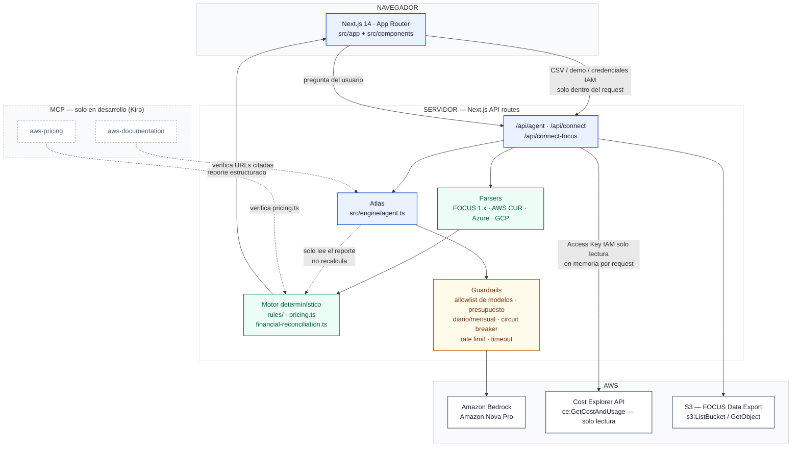
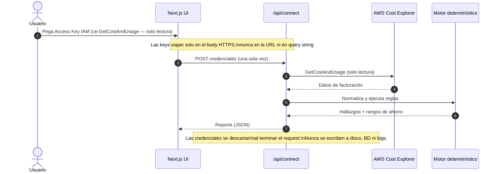
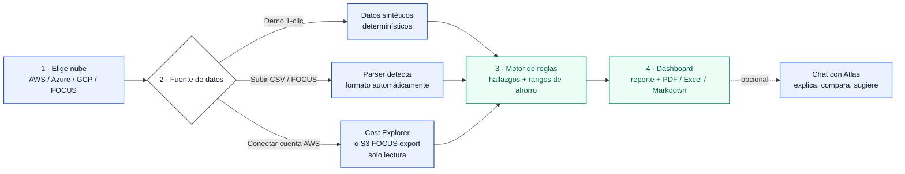

# Arquitectura — FinOps Agent (Nimbus Explorer)

Documento de referencia técnica para jurado y equipo. Cubre los componentes
del sistema, el flujo de datos, el modelo de seguridad y cómo se usó Kiro
para construir el proyecto.

**Principio rector:** las cifras y hallazgos siempre los produce el motor
determinístico (`src/engine/`). Atlas, el agente conversacional sobre Amazon
Bedrock, solo explica, compara o propone estrategia sobre resultados ya
calculados — nunca recalcula ni completa datos ausentes. Ver
[README.md](README.md) para variables de entorno y detalle completo de límites.

## Índice

1. [Arquitectura general](#1-arquitectura-general)
2. [Conexión AWS en vivo](#2-conexión-aws-en-vivo-modelo-de-seguridad)
3. [Flujo de uso del usuario](#3-flujo-de-uso-del-usuario)
4. [Uso de Kiro en el desarrollo](#4-uso-de-kiro-en-el-desarrollo)

---

## 1. Arquitectura general

| Componente | Rol | Verdad financiera |
|---|---|---|
| **Motor determinístico** (`src/engine/`) | Calcula hallazgos y rangos de ahorro (conservador → optimista) | Única fuente de cifras |
| **Atlas** (`agent.ts` → Bedrock) | Explica, compara, sugiere estrategia | Nunca calcula ni inventa números |
| **Guardrails** | Allowlist de modelos, presupuesto diario/mensual, circuit breaker, rate limit | Corta IA sin apagar el producto (`ATLAS_MODE=emergency`) |
| **MCP `aws-pricing` / `aws-documentation`** | Verifican precios y URLs citadas en tiempo de desarrollo | No corren en producción |

Las credenciales de Bedrock viven solo en variables de entorno del servidor.
Las credenciales de la cuenta AWS del **usuario** (Cost Explorer, S3) viven
solo en memoria durante cada request — ver sección 2.

## 2. Conexión AWS en vivo (modelo de seguridad)

El conector `/api/connect-focus` (S3) sigue el mismo patrón: `s3:ListBucket`
+ `s3:GetObject` en lugar de `ce:GetCostAndUsage`, lectura de CSV, CSV.gz o
Parquet, y el mismo motor de reglas al final. Las credenciales no se
persisten ni se registran deliberadamente.

## 3. Flujo de uso del usuario

## 4. Uso de Kiro en el desarrollo

El proyecto se construyó guiado por una spec versionada —
[`.kiro/specs/roadmap-focus-ai-s3.md`](.kiro/specs/roadmap-focus-ai-s3.md) —
con reglas de integridad transversales y tres fases secuenciales, cada una
cerrada por un gate de aceptación antes de avanzar a la siguiente.

| Fase | Entregable | Gate de aceptación |
|---|---|---|
| **1 — FOCUS** | Parser del estándar abierto FOCUS 1.x, detección automática multi-nube | `tsc --noEmit` y `npm run build` limpios; fixture FOCUS produce hallazgos |
| **2 — Lente de IA** | Reglas `ai-spend` (Bedrock, SageMaker, GPU) | Demo "startup de IA" produce los 3 hallazgos esperados; ninguna regla recomienda terminar instancias |
| **3 — Conector S3** | Lectura en vivo del FOCUS Data Export de AWS | CSV/CSV.gz y Parquet; manifiesto completo; límite agregado de 50 MiB |

Reglas de integridad de la spec, verificadas en cada fase:

- El LLM nunca inventa cifras — todo viene del motor.
- Fuentes citadas por Atlas se verifican con el MCP `aws-documentation` antes
  de publicarse (ejemplo: 50% de ahorro con Batch Inference de Bedrock,
  verificado contra la documentación oficial de AWS).
- El MCP `aws-pricing` verifica `src/engine/pricing.ts` contra el Price List
  API real de AWS en desarrollo — no en producción.
- Credenciales de usuario solo en memoria por request, nunca persistidas.

Cada fase cerró con una regresión contra `test-data/caso-prueba-aws.csv` y
`test-data/caso-prueba-focus.csv` para confirmar que ningún hallazgo
existente se rompiera.
