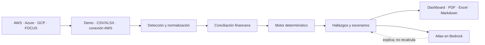

# Nimbus Explorer

**Convierte facturas de AWS, Azure, Google Cloud y FOCUS en decisiones FinOps
auditables. El motor calcula; Atlas explica y prioriza sin inventar cifras.**

Proyecto construido con Kiro y servicios de AWS para el
[**Hackathon AWS por Código Facilito (Kiro + AWS)**](https://docs.google.com/document/d/1t2dTuy-Fv9tLVlB_YMentggLBh-98kbS8oKdYJdCW3o/edit?tab=t.0).

**Vertical:** Agentes especializados  
**Estado:** prototipo funcional  
**Idioma:** Español e inglés  
**Código:** [github.com/alexisotogon-cyber/nimbus-explorer](https://github.com/alexisotogon-cyber/nimbus-explorer)  
**Demo pública:** `PENDIENTE — agrega aquí la URL final`  
**Video (máximo 5 minutos):** `PENDIENTE — agrega aquí la URL pública`

> **La idea en una frase:** Nimbus transforma datos de facturación multicloud
> en prioridades FinOps claras, medibles y accionables.

## El problema

Una factura cloud dice cuánto se gastó, pero no qué conviene investigar,
cuánto podría recuperarse ni qué evidencia falta para actuar con seguridad.
Hacer esa revisión manualmente consume horas por cuenta; repetirla entre
AWS, Azure y Google Cloud añade formatos, conceptos y criterios distintos.

Enviar el archivo completo a un modelo de IA tampoco resuelve el problema:
una explicación convincente no garantiza que los totales concilien con la
factura.

## La solución

Nimbus separa la **verdad financiera** de la **explicación conversacional**:

1. Un motor determinístico detecta el formato, normaliza la facturación,
   concilia costos y calcula oportunidades de ahorro.
2. Cada hallazgo muestra costo afectado, ahorro estimado, rango, confianza,
   supuestos, evidencia y una siguiente acción segura.
3. El simulador de Escenarios recalcula el portafolio completo sin usar IA.
4. Atlas, sobre Amazon Nova Pro en Amazon Bedrock, explica el reporte,
   relaciona preguntas con lo visible en pantalla y ayuda a priorizar.
5. El resultado se puede entregar como PDF ejecutivo, Excel editable o
   Markdown preparado para otra IA.

Si Bedrock no está disponible, el análisis, los escenarios, las exportaciones
y las respuestas financieras factuales siguen funcionando.

## Pruébalo en 60 segundos

1. Abre la demo pública (`PENDIENTE — agrega aquí la URL final`).
2. Elige AWS, Azure, GCP o FOCUS.
3. Selecciona una complejidad y variante de demo, y pulsa **Probar demo**.
4. Revisa la conciliación y abre una oportunidad prioritaria.
5. Cambia un valor en **Escenarios** y observa el impacto mensual y anual.
6. Abre Atlas y pregunta:
   - `¿Cuál es el hallazgo con mayor ahorro?`
   - `¿Qué dato debo validar primero?`
   - `Dame un plan de acción con mis tres oportunidades principales.`
7. Descarga el reporte en PDF o el plan de acción en Excel.

Las demos usan datos sintéticos reproducibles. La misma combinación de
proveedor, complejidad y variante genera siempre el mismo resultado.

<!-- Reemplaza este comentario con capturas finales sin datos sensibles.

## Nimbus en acción


-->

## Qué lo hace diferente

### La IA no calcula

Los importes provienen exclusivamente del motor de reglas de
[`src/engine`](src/engine). Atlas recibe un reporte estructurado y puede
explicarlo, compararlo o convertirlo en un plan, pero no recalcula costos ni
completa datos ausentes.

Las preguntas sobre gasto, conciliación, escenarios y hallazgos prioritarios
se resuelven por una ruta determinística de **0 tokens**.

### Rangos auditables, no promesas

Nimbus no presenta un único ahorro como certeza. Cada oportunidad declara:

- costo afectado;
- escenario actual;
- rango conservador–optimista;
- supuestos y sensibilidad;
- nivel de evidencia;
- métrica que falta comprobar;
- acción de investigación, remediación y reversión.

### FOCUS como lenguaje común

El proyecto reconoce FOCUS 1.x y conserva compatibilidad con exportaciones
nativas de AWS, Azure y GCP. Los catálogos versionados identifican servicios
y conceptos de facturación; no sustituyen los precios ni los costos reales
del archivo del usuario.

### Una lente específica para costos de IA

Nimbus incluye reglas para:

- visibilidad del gasto de IA;
- inferencia intensiva On-Demand en Amazon Bedrock;
- endpoints de SageMaker activos continuamente;
- capacidad GPU encendida;
- gasto de IA sin atribución a cuenta, proyecto o equipo.

### Te dice qué puede demostrar el archivo

Un resumen agregado de consola y un export granular no contienen la misma
evidencia. Nimbus informa:

- filas utilizadas y descartadas;
- cobertura de columnas;
- capacidades habilitadas por el archivo;
- recomendaciones que no pueden verificarse todavía;
- campos o granularidad necesarios para desbloquearlas.

No inventa hallazgos cuando una muestra tiene muy pocas filas o carece de
evidencia suficiente.

## Capacidades por fuente

| Fuente | Demo reproducible | Archivo | Conexión en vivo | Diagnóstico de cobertura |
|---|:---:|:---:|:---:|:---:|
| AWS | Sí | Cost Explorer CSV, CUR, Data Exports y FOCUS | Cost Explorer y S3 FOCUS, solo lectura | Sí |
| Azure | Sí | Cost Analysis, Cost Details y FOCUS en CSV/XLSX/XLSM | Próximamente | Sí |
| Google Cloud | Sí | Reports CSV, BigQuery billing export y FOCUS en CSV/XLSX/XLSM | Próximamente | Sí |
| Multicloud | Sí | FOCUS | Mediante S3 FOCUS de AWS | Sí |

Las muestras canónicas de tres filas sirven para conocer el formato. Las
demos analíticas de 30 días están separadas y sí permiten explorar hallazgos.

## Recorrido funcional



El detalle de componentes, límites de confianza y flujos de credenciales está
en [ARCHITECTURE.md](ARCHITECTURE.md).

## Uso de AWS

| Servicio | Función en Nimbus | Alcance |
|---|---|---|
| **Amazon Bedrock** | Ejecuta Atlas con Amazon Nova Pro para preguntas abiertas | El análisis no depende del modelo |
| **AWS Cost Explorer** | Consulta opcional de los últimos costos de la cuenta | `ce:GetCostAndUsage`, solo lectura |
| **Amazon S3** | Lee un FOCUS Data Export en CSV, CSV.gz o Parquet desde el bucket del usuario | `s3:ListBucket` y `s3:GetObject`, solo lectura |
| **AWS Price List API** | Verifica precios de referencia mediante el MCP `aws-pricing` | Desarrollo; no participa en los cálculos de la factura |

Las credenciales de conexión del usuario son opcionales. Para la evaluación se
pueden utilizar demos reproducibles o archivos sintéticos sin compartir una
cuenta AWS.

## Cómo usamos Kiro

El proyecto no se construyó a partir de prompts aislados. Se desarrolló con
especificaciones versionadas, requisitos verificables y gates de aceptación:

- [Spec principal: requisitos](.kiro/specs/nimbus-explorer-overview/requirements.md)
- [Spec principal: diseño](.kiro/specs/nimbus-explorer-overview/design.md)
- [Spec principal: tareas](.kiro/specs/nimbus-explorer-overview/tasks.md)
- [Roadmap FOCUS, IA y S3](.kiro/specs/roadmap-focus-ai-s3.md)
- [Configuración MCP](.kiro/settings/mcp.json)

Kiro ayudó a mantener cinco invariantes durante la implementación:

1. La IA nunca es la fuente de una cifra financiera.
2. Un proveedor o servicio desconocido se conserva en vez de descartarse.
3. Los totales concilian antes y después de normalizar.
4. Las credenciales no se almacenan ni aparecen en respuestas o logs.
5. Atlas puede apagarse sin apagar el producto.

Los MCP de desarrollo complementan el flujo:

- `aws-pricing` contrasta precios de referencia con AWS Price List API;
- `aws-documentation` ayuda a validar documentación oficial utilizada por las
  reglas.

## Relación con los criterios de evaluación

| Criterio de la convocatoria | Peso | Evidencia en Nimbus |
|---|---:|---|
| Impacto tecnológico | 30% | Reduce la revisión manual multicloud y convierte facturación en acciones verificables |
| Innovación | 30% | Separa cálculo e IA, audita gasto de IA, soporta FOCUS y declara incertidumbre |
| Software funcional y entregables | 30% | Flujo completo, conectores, escenarios, exportaciones, ES/EN y pruebas reproducibles |
| Uso de AWS y Kiro | 10% | Bedrock, Cost Explorer, S3, Price List API, specs y MCP versionados |

## Seguridad y control de costos

- Las credenciales de Bedrock viven únicamente en variables del servidor.
- Las credenciales opcionales de Cost Explorer o S3 se utilizan en memoria
  durante la solicitud y no se guardan en disco ni base de datos.
- Los archivos y datos cargados se tratan como evidencia no confiable, no
  como instrucciones para Atlas.
- En despliegue se fija `ATLAS_ALLOWED_MODEL_IDS`; el servidor rechaza
  cualquier modelo que no forme parte de esa lista.
- Atlas tiene límite de entrada y salida, historial
  compacto, una herramienta máxima, timeout, rate limit, presupuestos y
  circuit breaker.
- `ATLAS_MODE=emergency` deshabilita las llamadas de IA, pero conserva el
  análisis determinístico.
- Nimbus nunca ejecuta cambios en la infraestructura del usuario. Los comandos
  de investigación son de solo lectura y cualquier remediación requiere
  validación humana.

> Para una integración productiva, el siguiente paso de seguridad es reemplazar
> access keys por roles cross-account con `sts:AssumeRole` y external ID.

## Instalación local

Requisitos: Node.js 20+ y npm.

```bash
git clone https://github.com/alexisotogon-cyber/nimbus-explorer.git
cd finops-agent
npm install
cp .env.example .env.local
npm run dev
```

Abre [http://localhost:3000](http://localhost:3000). No necesitas credenciales
para utilizar las demos ni analizar archivos.

Para ejecutar un build de producción:

```bash
npm run build
npm start
```

## Configuración opcional de Atlas

```bash
# Solo en el servidor
BEDROCK_ACCESS_KEY_ID=
BEDROCK_SECRET_ACCESS_KEY=
BEDROCK_REGION=us-east-1
BEDROCK_MODEL_ID=amazon.nova-pro-v1:0
ATLAS_ALLOWED_MODEL_IDS=amazon.nova-pro-v1:0

# Defaults seguros para la demo
ATLAS_MODE=normal
ATLAS_MAX_OUTPUT_TOKENS=220
ATLAS_MAX_MESSAGES_PER_AUDIT=12
ATLAS_MAX_TOOL_CALLS=1
ATLAS_MAX_HISTORY_MESSAGES=4
ATLAS_DAILY_TOKEN_BUDGET=100000
ATLAS_DAILY_COST_BUDGET_USD=1.50
ATLAS_MONTHLY_COST_BUDGET_USD=25
```

Consulta [.env.example](.env.example) para el resto de controles. Si las
credenciales no están configuradas, Atlas conserva las respuestas de 0 tokens
y avisa únicamente cuando una pregunta abierta requiere Bedrock.

## Verificación

Última verificación local: **26 de julio de 2026**.

| Comprobación | Resultado |
|---|:---:|
| Build de producción, TypeScript y lint | PASS |
| AWS, Azure, GCP, FOCUS 1.4 y cobertura determinística | PASS |
| Demos reproducibles y variantes | PASS |
| Claridad de proyección y conciliación | PASS |
| Integridad y antigüedad de catálogos | PASS |
| `next dev` durante `next build` | PASS |

```bash
npm run build
npm run test:billing
npm run test:demos
npm run test:p1
npm run test:projection
npm run catalogs:check
npm run test:concurrent-next
```

Además existen fixtures de regresión para AWS, Azure, GCP y FOCUS; pruebas de
ejemplos canónicos, exportaciones premium, controles de Atlas, i18n, S3 y
contexto conversacional en [`test-data`](test-data).

Las reglas que proyectan ahorro requieren al menos siete días distintos de
evidencia. Un archivo más corto puede validar formato y totales, pero Nimbus
no inventará una recomendación mensual.

## Visión de producto

El prototipo demuestra el ciclo completo de una auditoría. La evolución hacia
un producto FinOps colaborativo se divide en cuatro líneas:

### 1. Conocimiento FinOps curado

Incorporar una base de conocimiento tipo RAG con documentación oficial de
FOCUS, AWS, Azure, Google Cloud, FinOps Foundation y marcos Well-Architected.
Cada fragmento deberá conservar fuente, versión, fecha de consulta y ámbito
del proveedor.

El RAG servirá para explicar conceptos, comparar alternativas y citar
documentación vigente. No podrá modificar cifras, crear precios ni sustituir
la evidencia de facturación. Los datos privados del cliente permanecerán
separados del índice documental.

### 2. Cuentas, espacios de trabajo y presupuestos

Añadir usuarios y organizaciones para:

- guardar auditorías y escenarios;
- crear presupuestos por cuenta, nube, equipo, proyecto o centro de costo;
- agrupar cuentas en portafolios;
- asignar responsables y fechas a oportunidades;
- comparar gasto observado, proyección y presupuesto;
- conservar historial, comentarios y trazabilidad de decisiones.

Los permisos seguirán un modelo por organización y rol para evitar que un
usuario consulte facturación de otro equipo.

### 3. Conectores administrados para Azure y Google Cloud

- **Azure:** Cost Management Exports y Cost Details mediante una identidad de
  aplicación con permisos mínimos y acceso de solo lectura.
- **Google Cloud:** Cloud Billing Export y Billing Catalog mediante identidad
  federada y permisos mínimos.
- Sincronización incremental, diagnóstico de cobertura y estado de cada
  conexión sin cambiar el modelo financiero común.

### 4. Identidad federada y protección de secretos

La meta no es almacenar access keys permanentes:

- AWS mediante `sts:AssumeRole`, rol cross-account y external ID único por
  cliente;
- Azure y Google Cloud mediante identidades federadas y credenciales de corta
  duración;
- si un secreto fuera inevitable, almacenarlo fuera de la base de datos en un
  gestor de secretos, cifrado con una clave administrada, rotación, separación
  por tenant y auditoría de acceso.

La transición productiva también requiere almacenamiento cifrado de reportes,
retención configurable, borrado verificable y controles distribuidos para
sesiones, rate limits y presupuestos de Atlas.

## Limitaciones conocidas

- Azure y GCP se analizan actualmente mediante archivos; sus conectores en
  vivo están en el roadmap.
- Cost Explorer agregado permite validar gasto y distribución, pero un CUR,
  Data Export o FOCUS granular aporta mejores hallazgos por recurso.
- Sesiones, caché, presupuestos y circuit breaker viven en memoria, apropiado
  para una demo de una sola instancia. Un despliegue distribuido debe usar un
  almacén compartido.
- Los catálogos reconocen servicios y conceptos; no contienen los precios
  contractuales del cliente.
- Las recomendaciones son informativas y requieren validar métricas antes de
  ejecutar cambios.

## Entregables

| Entregable requerido | Estado | Enlace |
|---|:---:|---|
| Repositorio público con README | Listo | [GitHub](https://github.com/alexisotogon-cyber/nimbus-explorer) |
| Demo funcional en línea | Pendiente de URL final | `PENDIENTE` |
| Video público de máximo 5 minutos | Pendiente de grabación/publicación | `PENDIENTE` |
| Arquitectura | Lista | [ARCHITECTURE.md](ARCHITECTURE.md) |
| Evidencia de uso de Kiro | Lista | [.kiro](.kiro) |

## Equipo

**Alexis Soto González**

Creador y desarrollador principal — producto, arquitectura FinOps,
experiencia de usuario e integración con AWS/Kiro.

## Licencia

Este proyecto se distribuye bajo la [licencia MIT](LICENSE).

---

**Aviso:** Nimbus ofrece recomendaciones informativas basadas en la evidencia
de facturación disponible. Valida cada acción en tu entorno antes de aplicarla.
